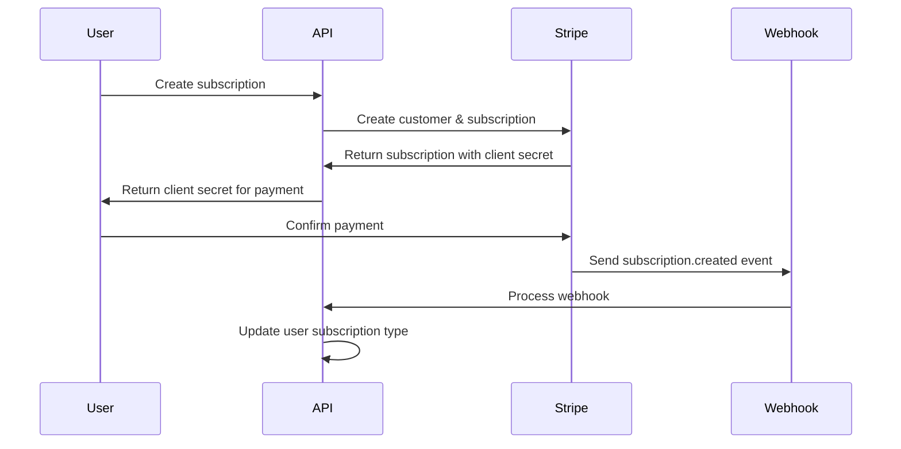
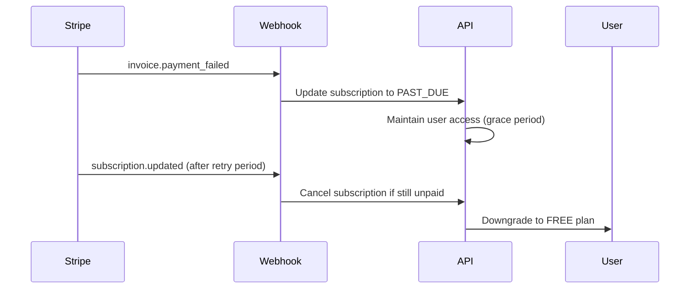
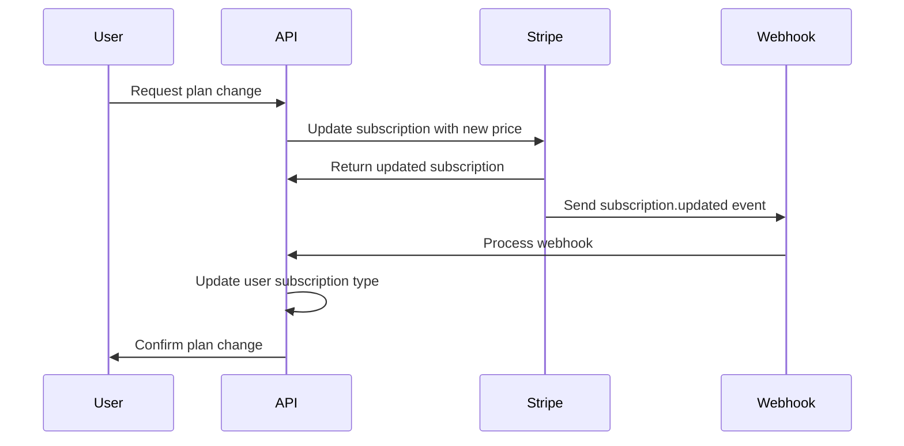

# Subscription Model Implementation Guide

This document describes the comprehensive Stripe subscription integration with proper tracking, webhook handling, and automated subscription management.

## 🏗️ Architecture Overview

### Dual Subscription System

The application implements a dual subscription system:

1. **User Subscription Type** (`subscription` field in User model)
   - Tracks the user's current plan level (FREE, BASIC, PREMIUM)
   - Used for feature access control and usage limits
   - Updated automatically based on Stripe subscription status

2. **Stripe Subscription Tracking** (Subscription model)
   - Tracks actual Stripe subscription details
   - Handles billing periods, payment status, and Stripe-specific data
   - Synchronized with Stripe via webhooks

## 📊 Subscription Model Structure

### Database Schema

```sql
CREATE TABLE subscriptions (
    id UUID PRIMARY KEY DEFAULT gen_random_uuid(),
    user_id UUID NOT NULL REFERENCES users(id) ON DELETE CASCADE,
    stripe_subscription_id VARCHAR UNIQUE NOT NULL,
    stripe_price_id VARCHAR NOT NULL,
    status subscription_status DEFAULT 'ACTIVE',
    current_period_start TIMESTAMP NOT NULL,
    current_period_end TIMESTAMP NOT NULL,
    created_at TIMESTAMP DEFAULT NOW(),
    updated_at TIMESTAMP DEFAULT NOW()
);

-- Performance indexes
CREATE INDEX idx_subscriptions_user_id ON subscriptions(user_id);
CREATE INDEX idx_subscriptions_status ON subscriptions(status);
CREATE INDEX idx_subscriptions_current_period_end ON subscriptions(current_period_end);
CREATE INDEX idx_subscriptions_stripe_subscription_id ON subscriptions(stripe_subscription_id);
```

### TypeScript Interface

```typescript
interface Subscription {
  id: string;
  userId: string;
  stripeSubscriptionId: string;
  stripePriceId: string;
  status: 'ACTIVE' | 'CANCELLED' | 'PAST_DUE';
  currentPeriodStart: Date;
  currentPeriodEnd: Date;
  createdAt: Date;
  updatedAt: Date;
}

enum SubscriptionStatus {
  ACTIVE = 'ACTIVE',
  CANCELLED = 'CANCELLED',
  PAST_DUE = 'PAST_DUE'
}
```

## 🔧 Key Features

### 1. Stripe Integration

**Complete Stripe Subscription Management:**
- Customer creation and management
- Subscription creation with payment methods
- Plan changes and upgrades/downgrades
- Automatic cancellation handling
- Payment failure management

**Example Usage:**
```typescript
// Create new subscription
const result = await StripeSubscriptionService.createStripeSubscription(
  userId,
  'price_1234567890', // Stripe price ID
  'pm_1234567890'     // Payment method ID (optional)
);

// Update subscription plan
await StripeSubscriptionService.updateStripeSubscription(
  'sub_1234567890',   // Stripe subscription ID
  'price_0987654321'  // New price ID
);

// Cancel subscription
await StripeSubscriptionService.cancelStripeSubscription(
  'sub_1234567890'
);
```

### 2. Webhook Integration

**Automated Webhook Handling:**
- `customer.subscription.created`
- `customer.subscription.updated`
- `customer.subscription.deleted`
- `invoice.payment_succeeded`
- `invoice.payment_failed`

**Webhook Processing:**
```typescript
// Webhook endpoint
POST /api/v1/webhooks/stripe

// Automatic processing of Stripe events
await StripeSubscriptionService.handleWebhookEvent(event);
```

### 3. Subscription Status Management

**Status Mapping:**
```typescript
// Stripe Status → Our Status
'active'     → 'ACTIVE'
'canceled'   → 'CANCELLED'
'past_due'   → 'PAST_DUE'
```

**Automatic Status Updates:**
- Payment success → ACTIVE
- Payment failure → PAST_DUE
- Subscription cancellation → CANCELLED
- User plan updates based on status changes

### 4. Billing Period Tracking

**Period Management:**
- Accurate tracking of billing periods
- Automatic renewal detection
- Prorated changes for plan upgrades
- Grace period handling for failed payments

## 🚀 Service Layer Implementation

### StripeSubscriptionService Methods

```typescript
class StripeSubscriptionService {
  // Core subscription management
  static async createStripeSubscription(userId: string, priceId: string, paymentMethodId?: string)
  static async updateStripeSubscription(stripeSubscriptionId: string, priceId: string)
  static async cancelStripeSubscription(stripeSubscriptionId: string)
  
  // Subscription retrieval
  static async getByStripeId(stripeSubscriptionId: string)
  static async getUserSubscriptions(userId: string)
  static async getUserActiveSubscription(userId: string)
  
  // Webhook handling
  static async handleWebhookEvent(event: Stripe.Event)
  
  // Status management
  static async updateSubscription(stripeSubscriptionId: string, data: UpdateSubscriptionData)
  static async cancelSubscription(stripeSubscriptionId: string)
  static async reactivateSubscription(stripeSubscriptionId: string)
  
  // Analytics and monitoring
  static async getSubscriptionStats()
  static async checkSubscriptionRenewals()
}
```

## 📋 API Endpoints

### Subscription Management

```typescript
// Create new subscription
POST /api/v1/subscriptions
{
  "priceId": "price_1234567890",
  "paymentMethodId": "pm_1234567890" // optional
}

// Get user's subscriptions
GET /api/v1/subscriptions

// Get active subscription
GET /api/v1/subscriptions/active

// Update subscription (change plan)
PUT /api/v1/subscriptions
{
  "priceId": "price_0987654321"
}

// Cancel subscription
DELETE /api/v1/subscriptions

// Get subscription limits
GET /api/v1/subscriptions/limits

// Get subscription history
GET /api/v1/subscriptions/history

// Get subscription plans
GET /api/v1/subscriptions/plans
```

### Webhook Endpoints

```typescript
// Stripe webhook handler
POST /api/v1/webhooks/stripe
// Raw body with Stripe signature verification

// Test webhook (development)
POST /api/v1/webhooks/test
{
  "eventType": "customer.subscription.created",
  "data": { ... }
}
```

## 🔄 Subscription Lifecycle

### 1. Subscription Creation Flow



### 2. Payment Failure Flow



### 3. Plan Change Flow



## 🛡️ Security and Validation

### 1. Webhook Security

```typescript
// Signature verification
const sig = req.headers['stripe-signature'];
const event = stripe.webhooks.constructEvent(req.body, sig, endpointSecret);

// Idempotency handling
const existingSubscription = await prisma.subscription.findUnique({
  where: { stripeSubscriptionId: subscription.id }
});
```

### 2. User Ownership Verification

```typescript
// All subscription operations verify user ownership
const subscription = await prisma.subscription.findFirst({
  where: {
    stripeSubscriptionId,
    userId // Ensures user can only access their own subscriptions
  }
});
```

### 3. Input Validation

```typescript
// Comprehensive validation for subscription operations
export const validateCreateStripeSubscription: ValidationChain[] = [
  body('priceId').isString().notEmpty(),
  body('paymentMethodId').optional().isString(),
];
```

## 📊 Monitoring and Analytics

### 1. Subscription Statistics

```typescript
const stats = await StripeSubscriptionService.getSubscriptionStats();
// Returns:
// {
//   totalSubscriptions: 1250,
//   activeSubscriptions: 980,
//   cancelledSubscriptions: 200,
//   pastDueSubscriptions: 70
// }
```

### 2. Renewal Tracking

```typescript
// Daily cron job to check upcoming renewals
cron.schedule('0 3 * * *', async () => {
  await StripeSubscriptionService.checkSubscriptionRenewals();
});
```

### 3. Usage Analytics

```typescript
// Track subscription events
logger.info('Subscription created', {
  userId,
  subscriptionId,
  priceId,
  timestamp: new Date()
});
```

## 🔧 Configuration

### Environment Variables

```env
# Stripe Configuration
STRIPE_SECRET_KEY=sk_test_...
STRIPE_PUBLISHABLE_KEY=pk_test_...
STRIPE_WEBHOOK_SECRET=whsec_...

# Subscription URLs
STRIPE_SUCCESS_URL=http://localhost:3001/subscription/success
STRIPE_CANCEL_URL=http://localhost:3001/subscription/cancel
```

### Stripe Price IDs

```typescript
// Link Stripe prices to subscription plans
const subscriptionPlans = [
  {
    type: 'BASIC',
    stripePriceId: 'price_basic_monthly',
    price: 9.99
  },
  {
    type: 'PREMIUM',
    stripePriceId: 'price_premium_monthly',
    price: 29.99
  }
];
```

## 🚨 Error Handling

### 1. Stripe API Errors

```typescript
try {
  const subscription = await stripe.subscriptions.create(params);
} catch (error) {
  if (error.type === 'StripeCardError') {
    // Card was declined
  } else if (error.type === 'StripeInvalidRequestError') {
    // Invalid parameters
  }
  throw new AppError('Subscription creation failed', 400);
}
```

### 2. Webhook Failures

```typescript
// Retry mechanism for failed webhooks
const maxRetries = 3;
let attempts = 0;

while (attempts < maxRetries) {
  try {
    await processWebhookEvent(event);
    break;
  } catch (error) {
    attempts++;
    if (attempts >= maxRetries) {
      logger.error('Webhook processing failed after retries', { eventId: event.id });
    }
  }
}
```

## 📈 Performance Considerations

### 1. Database Indexing

```sql
-- Essential indexes for subscription queries
CREATE INDEX idx_subscriptions_user_id ON subscriptions(user_id);
CREATE INDEX idx_subscriptions_status ON subscriptions(status);
CREATE INDEX idx_subscriptions_current_period_end ON subscriptions(current_period_end);
CREATE INDEX idx_subscriptions_stripe_subscription_id ON subscriptions(stripe_subscription_id);
```

### 2. Webhook Processing

```typescript
// Asynchronous webhook processing
export const handleStripeWebhook = asyncHandler(async (req, res) => {
  // Immediately return 200 to Stripe
  res.status(200).json({ received: true });
  
  // Process webhook asynchronously
  setImmediate(async () => {
    await StripeSubscriptionService.handleWebhookEvent(event);
  });
});
```

### 3. Caching Strategy

```typescript
// Cache subscription status for frequently accessed data
const cacheKey = `subscription:${userId}`;
let subscription = await redis.get(cacheKey);

if (!subscription) {
  subscription = await StripeSubscriptionService.getUserActiveSubscription(userId);
  await redis.setex(cacheKey, 300, JSON.stringify(subscription)); // 5 minute cache
}
```

## 🔄 Migration and Deployment

### 1. Database Migration

```sql
-- Create subscriptions table
CREATE TABLE subscriptions (
    id UUID PRIMARY KEY DEFAULT gen_random_uuid(),
    user_id UUID NOT NULL REFERENCES users(id) ON DELETE CASCADE,
    stripe_subscription_id VARCHAR UNIQUE NOT NULL,
    stripe_price_id VARCHAR NOT NULL,
    status subscription_status DEFAULT 'ACTIVE',
    current_period_start TIMESTAMP NOT NULL,
    current_period_end TIMESTAMP NOT NULL,
    created_at TIMESTAMP DEFAULT NOW(),
    updated_at TIMESTAMP DEFAULT NOW()
);

-- Add indexes
CREATE INDEX idx_subscriptions_user_id ON subscriptions(user_id);
CREATE INDEX idx_subscriptions_status ON subscriptions(status);
CREATE INDEX idx_subscriptions_current_period_end ON subscriptions(current_period_end);
CREATE INDEX idx_subscriptions_stripe_subscription_id ON subscriptions(stripe_subscription_id);
```

### 2. Stripe Configuration

```bash
# Set up Stripe webhook endpoint
stripe listen --forward-to localhost:3000/api/v1/webhooks/stripe

# Create products and prices
stripe products create --name "Basic Plan"
stripe prices create --product prod_xxx --unit-amount 999 --currency usd --recurring interval=month
```

This comprehensive Subscription model provides robust Stripe integration with automatic webhook handling, proper status tracking, and seamless user experience management.